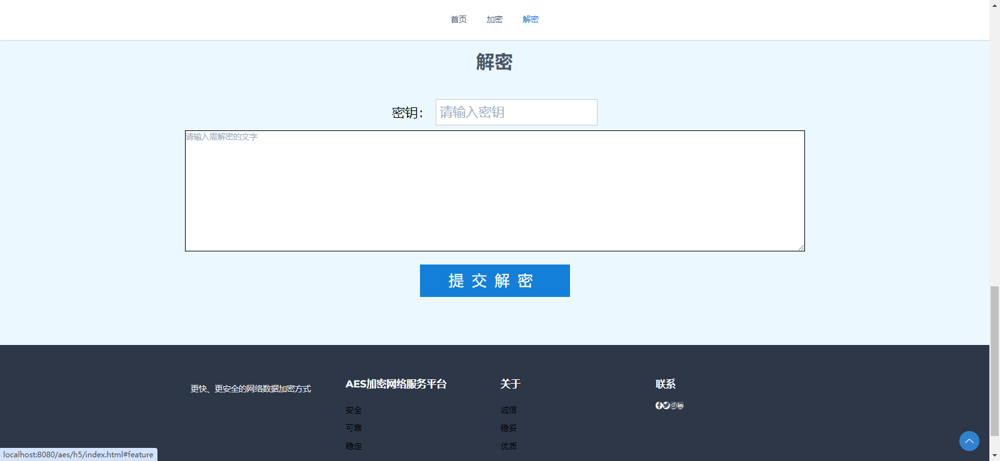
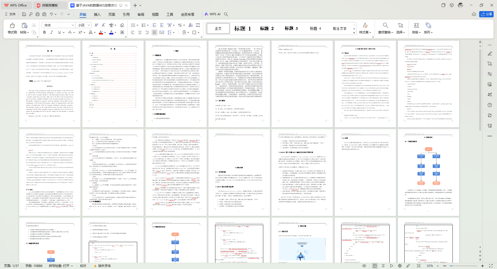

# 2-基于JAVA的数据AES加密方法设计


> 更多开源项目：https://docs.qq.com/sheet/DSFZBdFprRW12QWVw
>
> 更多开源项目：https://docs.qq.com/sheet/DSFZBdFprRW12QWVw

> 小技巧：有的项目可能并不是完全符合您的设计需求，比如您的需求是**XXX的交友系统**，其实完全可以用**XXX的论坛系统**来替换，题目都是同样的意思，但是换一种思路，更简单的解决了需求。
>
> **更多开源项目中包含上千套开源项目，已经注明了使用场景需要的可自行查找。**


## 简介

本代码来源于网络,仅供学习使用。若侵权，请联系删除。【**项目均经过人工调试，源码100%确保成功运行**】

本项目包含：**源码+数据库+1w字论文+PPT，可用于毕业设计、期末作业、课设等**

**项目地址：**

```
http://localhost:8080/aes/h5/index.html
```

**账号密码：**

```

```


## 关键技术

开发工具：**IntelliJ IDEA，Navicat，Mysql，Pycharm**

主要技术：**SpringBoot，SSM，Spring，SpringMVC，Mybatis，Mysql，Html，JS，CSS，Vue，Python**


## 使用场景

AES加密，数据安全，隐私保护，加密算法


## 共同学习

不会部署项目的可以添加VX：【**coderjun666**  】，共同探讨学习部署。


## 项目截图





